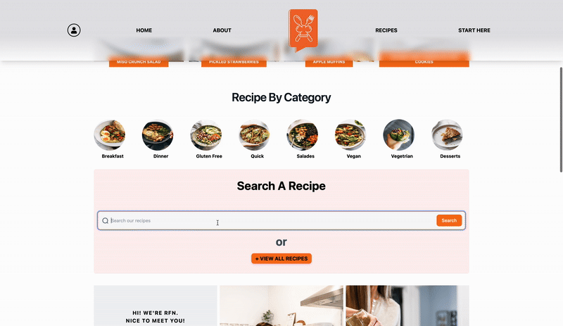
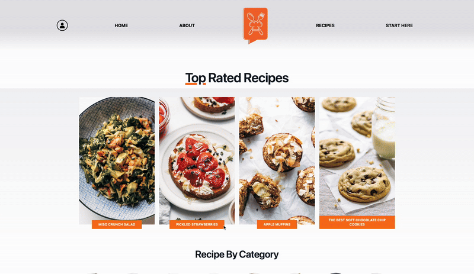
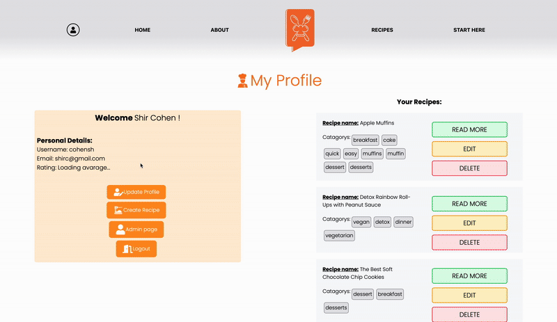
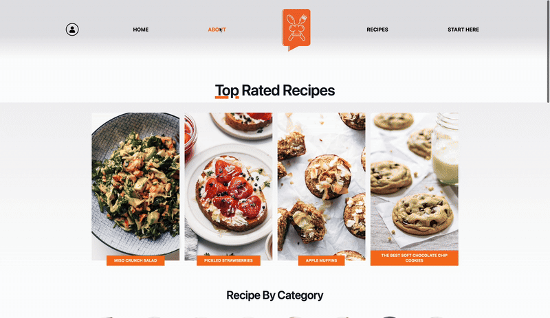

# 🍽️ Recipes for Everyone

A full-stack **recipe management web application** designed for home cooks, food enthusiasts, and aspiring chefs. Share your recipes, explore others' creations, and become part of a delicious community!

📚 About the Project

Recipes for Everyone is more than just a recipe site — it's a culinary community that helps users improve their cooking while sharing their stories, culture, and memories through food. It brings recipes to life with features that promote interaction, understanding, and joy in cooking.

## 🚀 Tech Stack

- **Frontend:** React.js, React Router, Vercel
- **Backend:** Node.js, Express.js, Render
- **Database:** MongoDB
- **Authentication:** JWT-based token system

---

## ✨ Features

### 🏠 Homepage & Recipe Discovery

Browse a wide variety of recipes sorted by categories like salads, desserts, vegan dishes, and more. Users can also view the top 4 highest-rated recipes featured on the homepage.


---

### 🔍 Smart Filtering & Search

Easily search for recipes using keywords or filter by multiple categories, events, or meal types.



---

### 🔐 User Authentication

Secure registration and login for users. Authenticated users can:
- Add/edit/delete their own recipes
- Rate and comment on others' recipes
- Manage their personal profile



---

### 📋 Recipe Details

Each recipe page includes:
- Prep time, difficulty level, ingredients, instructions
- Nutritional info and user rating
- Author’s name and recipe image


---

### 🧑‍🍳 Profile Management

Registered users get a **My Profile** page where they can:
- Manage their submitted recipes
- View and edit their latest comments
- Update personal details



---

### 🛠️ Admin Dashboard

Admin users can:
- Manage all users, recipes, and comments
- Promote or demote users between admin and regular roles



---

## 👥 User Roles

| Role           | Permissions |
|----------------|-------------|
| Guest          | Browse and search recipes |
| Registered User| Full recipe interaction: add, edit, delete, rate, comment |
| Admin          | Manage all users, recipes, and comments system-wide |

> **Demo Credentials:**

**Registered User**
- username: `registered` / `register2`
- password: `12345678`

**Admin**
- username: `admin` / `admin2`
- password: `12345678`

---

## 🧪 How to Run Locally

```bash
# Clone the repositories
git clone https://github.com/cohensh96/Recipe-App-Frontend
git clone https://github.com/cohensh96/Recipe-App-Backend


